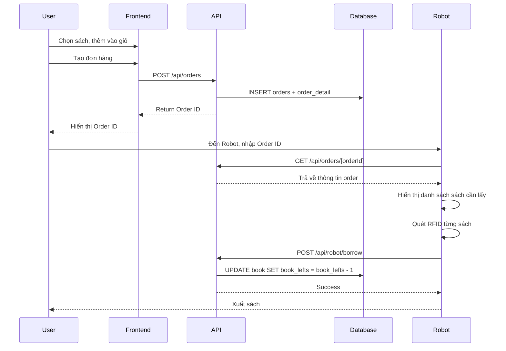
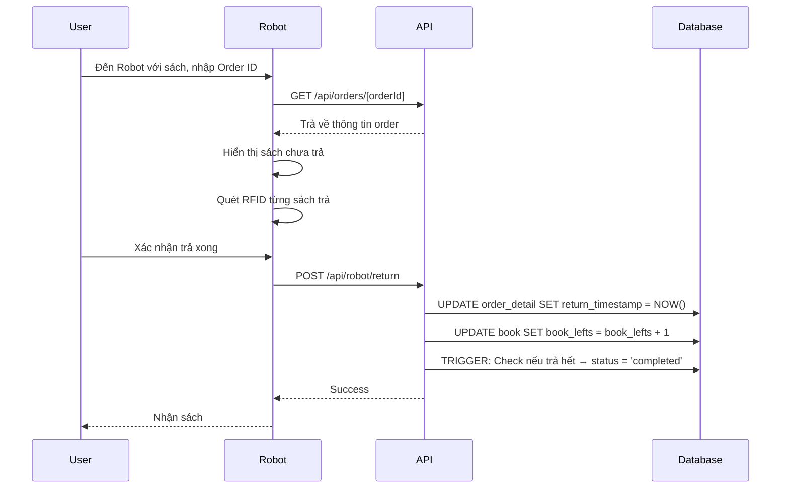

# 📡 API Backend Documentation

## Tổng quan

Backend được xây dựng với **Next.js API Routes**, xử lý tất cả logic nghiệp vụ và đồng bộ dữ liệu với Supabase PostgreSQL.

---

## 🔐 Authentication

### POST `/api/auth/login`
Đăng nhập người dùng

**Request Body:**
```json
{
  "email": "user@example.com",
  "password": "password123"
}
```

**Response (200):**
```json
{
  "user": {
    "user_id": 1,
    "email": "user@example.com",
    "role": "user",
    "created_at": "2024-01-01T00:00:00Z"
  }
}
```

**Errors:**
- `401`: Email hoặc mật khẩu không đúng
- `400`: Thiếu thông tin

---

## 👥 Users Management

### GET `/api/users`
Lấy danh sách tất cả người dùng

**Response (200):**
```json
{
  "users": [
    {
      "user_id": 1,
      "email": "user@example.com",
      "role": "user",
      "created_at": "2024-01-01T00:00:00Z"
    }
  ]
}
```

### POST `/api/users/create`
Tạo người dùng mới

**Request Body:**
```json
{
  "email": "newuser@example.com",
  "password": "password123",
  "role": "user"
}
```

**Response (201):**
```json
{
  "user": {
    "user_id": 2,
    "email": "newuser@example.com",
    "role": "user",
    "created_at": "2024-01-01T00:00:00Z"
  }
}
```

**Validations:**
- Email phải duy nhất
- Role phải là "admin" hoặc "user"

### DELETE `/api/users/[userId]`
Xóa người dùng

**Response (200):**
```json
{
  "message": "Xóa người dùng thành công"
}
```

**Business Logic:**
- Không cho xóa user có đơn hàng đang pending

---

## 📚 Books Management

### GET `/api/books`
Lấy danh sách sách

**Query Parameters:**
- `available=true`: Chỉ lấy sách còn hàng (book_lefts > 0)

**Response (200):**
```json
{
  "books": [
    {
      "rfid": "RFID001",
      "name": "Lập trình JavaScript",
      "book_lefts": 5,
      "position_x": 1.5,
      "position_y": 2.0,
      "position_z": 3.0
    }
  ]
}
```

### POST `/api/books`
Tạo sách mới

**Request Body:**
```json
{
  "rfid": "RFID001",
  "name": "Lập trình JavaScript",
  "book_lefts": 5,
  "position_x": 1.5,
  "position_y": 2.0,
  "position_z": 3.0
}
```

**Response (201):**
```json
{
  "book": { /* book data */ }
}
```

**Validations:**
- RFID phải duy nhất
- book_lefts >= 0

### PUT `/api/books`
Cập nhật thông tin sách

**Request Body:**
```json
{
  "rfid": "RFID001",
  "name": "Updated Name",
  "book_lefts": 10,
  "position_x": 2.0,
  "position_y": 2.5,
  "position_z": 3.5
}
```

### DELETE `/api/books`
Xóa sách

**Request Body:**
```json
{
  "rfid": "RFID001"
}
```

**Business Logic:**
- Không cho xóa sách đang được mượn (có trong order pending)

---

## 📦 Orders Management

### GET `/api/orders`
Lấy danh sách đơn hàng

**Query Parameters:**
- `userId`: Lọc theo user ID

**Response (200):**
```json
{
  "orders": [
    {
      "order_id": 1,
      "user_id": 1,
      "ts_created": "2024-01-01T00:00:00Z",
      "status": "pending",
      "users": {
        "user_id": 1,
        "email": "user@example.com",
        "role": "user"
      },
      "order_detail": [
        {
          "rfid": "RFID001",
          "return_timestamp": null,
          "book": {
            "rfid": "RFID001",
            "name": "Lập trình JavaScript"
          }
        }
      ]
    }
  ]
}
```

### POST `/api/orders`
Tạo đơn hàng mới

**Request Body:**
```json
{
  "userId": 1,
  "bookRfids": ["RFID001", "RFID002", "RFID003"]
}
```

**Response (201):**
```json
{
  "order": {
    "order_id": 1,
    "user_id": 1,
    "status": "pending",
    "ts_created": "2024-01-01T00:00:00Z",
    "order_detail": [...]
  }
}
```

**Business Logic:**
1. Validate tất cả RFID tồn tại
2. Validate tất cả sách còn hàng (book_lefts > 0)
3. Tạo order với status = 'pending'
4. Tạo order_detail cho từng sách
5. **KHÔNG trừ book_lefts** (chỉ trừ khi Robot xác nhận mượn)

### GET `/api/orders/[orderId]`
Lấy thông tin chi tiết 1 đơn hàng

**Response (200):**
```json
{
  "order": {
    "order_id": 1,
    "user_id": 1,
    "status": "pending",
    "ts_created": "2024-01-01T00:00:00Z",
    "users": { /* user info */ },
    "order_detail": [
      {
        "rfid": "RFID001",
        "return_timestamp": null,
        "book": {
          "rfid": "RFID001",
          "name": "Lập trình JavaScript",
          "book_lefts": 5,
          "position_x": 1.5,
          "position_y": 2.0,
          "position_z": 3.0
        }
      }
    ]
  }
}
```

---

## 🤖 Robot Operations

### POST `/api/robot/borrow`
Xử lý mượn sách (Robot xuất sách)

**Request Body:**
```json
{
  "orderId": 1
}
```

**Response (200):**
```json
{
  "message": "Đã mượn 3 sách thành công",
  "order": { /* updated order */ }
}
```

**Business Logic:**
1. Validate order tồn tại và status = 'pending'
2. Lấy danh sách sách chưa được mượn (return_timestamp = NULL)
3. Validate tất cả sách còn hàng
4. **Trừ book_lefts** cho từng sách
5. Order status vẫn là 'pending' (chờ trả)

**Flow nghiệp vụ:**
```
User tạo order → Robot quét RFID → Gọi API này → Trừ book_lefts → Xuất sách
```

### POST `/api/robot/return`
Xử lý trả sách (Robot nhận sách)

**Request Body:**
```json
{
  "orderId": 1,
  "rfids": ["RFID001", "RFID002"]
}
```

**Response (200):**
```json
{
  "message": "Đã trả 2 sách thành công",
  "returnedBooks": [
    { "rfid": "RFID001", "name": "Lập trình JavaScript" },
    { "rfid": "RFID002", "name": "React cơ bản" }
  ],
  "allReturned": false,
  "order": { /* updated order */ }
}
```

**Business Logic:**
1. Validate order tồn tại
2. Validate tất cả RFID thuộc order
3. Validate sách chưa được trả (return_timestamp = NULL)
4. Cập nhật **return_timestamp** = NOW()
5. **Cộng book_lefts** cho từng sách
6. **Trigger tự động** đổi status thành 'completed' nếu đã trả hết

**Flow nghiệp vụ:**
```
User đến Robot → Robot quét RFID → Gọi API này → Cộng book_lefts + Update timestamp → Nhận sách
```

---

## 📊 Reports

### GET `/api/reports/summary`
Lấy thống kê tổng quan hệ thống

**Response (200):**
```json
{
  "summary": {
    "users": {
      "total": 10,
      "admins": 2,
      "regularUsers": 8
    },
    "books": {
      "total": 50,
      "inStock": 200,
      "borrowed": 15
    },
    "orders": {
      "total": 100,
      "pending": 5,
      "completed": 95
    }
  }
}
```

---

## 🔄 Quy trình nghiệp vụ hoàn chỉnh

### 1️⃣ User mượn sách



### 2️⃣ User trả sách



---

## 🛡️ Error Handling

Tất cả API đều có error handling chuẩn:

**Success Response:**
- Status: 200 (GET), 201 (POST/CREATE)
- Body: `{ data... }`

**Error Response:**
- Status: 400 (Bad Request), 401 (Unauthorized), 404 (Not Found), 500 (Server Error)
- Body: `{ "error": "Error message" }`

**Common Errors:**
- `400`: Thiếu thông tin, validation thất bại
- `401`: Đăng nhập thất bại
- `404`: Không tìm thấy resource
- `405`: Method không được hỗ trợ
- `500`: Lỗi server

---

## 🔒 Database Constraints

### Ràng buộc tự động:
1. **book_lefts >= 0** (CHECK constraint)
2. **Foreign keys CASCADE/RESTRICT**
3. **Trigger tự động cập nhật order status**

### Validation trong API:
1. Email phải duy nhất
2. RFID phải duy nhất
3. Không xóa user có order pending
4. Không xóa sách đang được mượn
5. Không mượn sách hết hàng
6. RFID phải thuộc order khi trả sách

---

## 📝 Notes

- **Password**: Hiện tại lưu plain text (demo only). Production cần hash với bcrypt
- **Authentication**: Sử dụng localStorage (demo). Production cần JWT/Session
- **Transaction**: Một số operation cần atomic transaction để đảm bảo data consistency
- **Logging**: Cần thêm logging cho audit trail
- **Rate Limiting**: Cần thêm rate limiting để chống abuse

---

Tài liệu này mô tả đầy đủ backend API và quy trình nghiệp vụ của hệ thống Library Robot! 🎉
